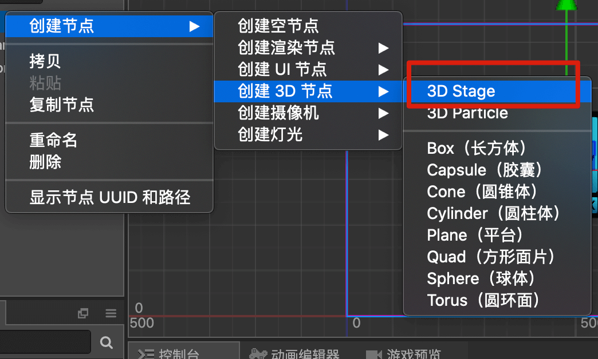

## ***Cocos Creator 问题汇总***


***Q***：有没有办法获取 Prefab 引用的项目资源路径，我想用它来判断资源是不是属于项目公用资源？

***A***：目前引擎没有办法在运行时将 res 的包体资源相对路径转化为项目相对路径。但是目前这里提供两个方案供你参考。

​	 1、通过 `cc.loader.getDependsRecursively("resUrl")` 获取打包后的资源引用路径，然后再通过 ` cc.loader.getRes(url, cc.Asset)` 获取加载的资源对象缓存，通过判断资源对象的其它属性来判断是否公共资源。

​	2、通过插件获取项目发布之后的资源路径，然后将该路径数据记录到游戏数据中。插件参考：https://github.com/cocos-creator/demo-process-build-textures


---


***Q***:  IOS 上，按两下 HOME 键出现进程列表，再回到游戏，声音就会丢失，请问怎么处理？

***A***: 可以在 `platforms/wechat/wrapper/unify.js` 里加上下面两句代码

```javascript
utils.cloneMethod(globalAdapter, wx,'onAudioInterruptionEnd');
utils.cloneMethod(globalAdapter, wx,'onAudioInterruptionBegin');
```

然后在 `Game.js` 里，你只要这样做就行里

```javascript
__globalAdapter.onAudioInterruptionEnd&&__globalAdapter.onAudioInterruptionEnd(onShown);
__globalAdapter.onAudioInterruptionBegin&&__globalAdapter.onAudioInterruptionBegin(onHidden);
```

相关pr参考：https://github.com/cocos-creator-packages/adapters/pull/118


---


***Q***： cc.Graphics ，这个组件填充时，能填充一张图片而不是单色吗？

***A***：支持绘制 svg 矢量图形：参考这个项目 : https://github.com/2youyou2/raphael-example

​	

***


***Q***:  自定义控件可以做全局吗？不然每个项目都要重新做一套，使用起来很麻烦

***A***:  可以做得通用一点，然后导出资源 Prefab 。然后哪个项目需要用，你就导入即可

​     另外就是可以把资源放到 内置资源文件夹中,目录如下：

​     CocosCreator_2.2.2\resources\static\default-assets\prefab


---


***Q*** 远程资源的合拼图资源怎么加载 png 和 plist 

***A***：

```
const LoadRemotePlist = require("./LoadRemotePlist");

cc.Class({
    extends: cc.Component,

    properties: {
    },

    start () {
        LoadRemotePlist("http://127.0.0.1:5500/assets/resources/emoji.plist",(err, plist)=>{
            let spriteFrames = plist.getSpriteFrames();
        });
    },
});
```

具体 `LoadRemotePlist` 脚本代码，参考 demo :https://github.com/Jno1995/load-remote-plist


---

***Q***: 打包到微信端的小游戏，在安卓上运行的时候会有突然卡顿的现象，在 iOS 上又没有。使用的Cocos Creator 从 2.2.1~2.3.3 版本 开发的小游戏都有(游戏类型：IO )

***A***: 1、针对游戏帧率：从 60 帧，定制修改成 30 帧，可以针对到一些低端的手机。

​	2、字体优化：尽量使用 `bmfont` 字体，不使用系统字体，开启 `dynamicAtlas` 功能，`Label` 的`CacheMode` 选择为 `BITMAP` 

​	3、使用 `nodepool`，将所有的粒子，游戏中的玩家，还有一些经常出现的元素，全部提前创建好

​	相关优化文章参考：https://www.cocos.com/3493#3493


---


***Q***：.fbx 格式的模型在 2.2.2 版本不显示

***A***：2.3.0 版本之前对 3d 模型的支持不够完善的问题。从 2.3.0 版本开始，支持一键创建 3d 场景必须的节点。包括缩放问题。 

 	2.3 版本的截图：

---


***Q***：怎么让 Creator 支持 ts emitDecoratorMetadata 的参数？

***A***：首先 npm init 之后 npm i reflect-metadata --save 

​	  然后再 `tsconfig.json` 中加入 "experimentalDecorators": true

​	  参考链接：https://www.jianshu.com/p/bf600274a004


---


***Q***:  如何执行同步动作？

***A***：`cc.tween` 在链式执行时是按照 sequence 的方式来执行的，但是在编写复杂缓动的时候可能会需要同时并行执行多个队列，`cc.tween` 提供了 parallel 接口来满足这个需求

```js
let t = cc.tween;
t(this.node)
    // 同时执行两个 cc.tween
    .parallel(
        t().to(1, { scale: 2 }),
        t().to(2, { position: cc.v2(100, 100) })
    )
    .call(() => {
        console.log('All tweens finished.')
    })
    .start()
```


---


***Q***：游戏加入了几个粒子后，加载起来会特别卡。

***A***：经过 demo 测试发现，加入的粒子里面使用内嵌的 Base64 图片数据，这类数据加载起来会很慢，建议把图片数据提取为单独的图片。


---


